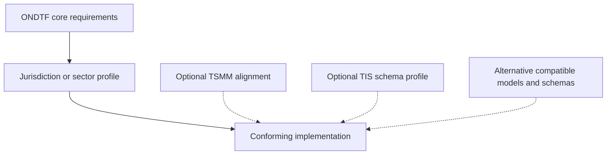

# Open National Digital Trust Framework (ONDTF)

[](https://qbf-consulting.github.io/open-national-digital-trust-framework/)
[](RELEASE_NOTES.md)
[](CHANGELOG.md)

The **Open National Digital Trust Framework (ONDTF)** is a jurisdiction-neutral, multi-sector reference framework for governing, implementing, assuring, and interoperating digital trust infrastructure.

ONDTF treats trust as an operational system property. It connects identity, authority, policy, evidence, assurance, decision, effect, accountability, and redress without requiring a single identity system, credential format, registry, protocol, or technology provider.

**Author and maintainer:** Sankarshan Mukhopadhyay, QBF Consulting LLP — `sankarshan@qbfconsulting.digital`  
**Project stewardship:** QBF Consulting LLP  
**Canonical repository:** https://github.com/qbf-consulting/open-national-digital-trust-framework

## What problem does this solve?

National digital programmes often provide identity, authentication, payments, data exchange, credentials, or registries independently. They rarely provide one coherent model for determining who or what is acting, under whose authority, within which policy and jurisdiction, using what evidence, with what assurance, producing which attributable effect, and through which challenge, revocation, and remedy path.

ONDTF supplies that missing governance and architecture layer.

## Repository status

| Attribute | Value |
|---|---|
| Portfolio role | Jurisdiction-neutral national framework |
| Lifecycle | Active Stable Specification |
| Current version | v1.0.0 |
| Stability | Stable normative contract with governed v1.x compatibility |
| Evidence maturity | E1 — repository-controlled reference/executable evidence |
| Primary artefact | Framework, reference architecture, and profile method |
| Normative posture | Normative requirements are explicitly labelled and version-controlled |
| India material | Illustrative jurisdiction profile under `profiles/india/` |
| Stewardship | QBF Consulting LLP |
| Validation | `make validate && make site` |

## Framework independence and optional compatibility

ONDTF is self-contained at the framework level, implementation-neutral at the architecture level, and extensible through jurisdiction, sector, and technical profiles. Core adoption does not require any particular external meta-model, schema suite, protocol, registry product, or software stack.

Two related QBF-stewarded projects provide optional implementation accelerators:

- **[Trust Systems Meta-Model (TSMM)](https://github.com/qbf-consulting/trust-systems-meta-model):** a compatible reference meta-model that may be used for deeper semantic formalisation.
- **[Trust Infrastructure Schemas (TIS)](https://github.com/qbf-consulting/trust-infrastructure-schemas):** a compatible schema suite that may be selected by an implementation or profile for portable machine-readable artefacts.



See [Framework independence](docs/foundations/framework-independence.md), [Portfolio alignment](docs/foundations/portfolio-alignment.md), and [Dependency policy](docs/foundations/dependency-policy.md).

## Start here

For adoption, begin with **[Adopt ONDTF](docs/adoption/adopt-ondtf.md)**. It provides one operational path from suitability and scope through Guided Framework Construction, profile production, implementation, evidence collection and conformance.

Supporting entry points:

- **[ONDTF in One Hour](https://qbf-consulting.github.io/open-national-digital-trust-framework/docs/learning/one-hour.html)**
- **[Choose a role-based learning path](https://qbf-consulting.github.io/open-national-digital-trust-framework/learn/)**
- **[Use the starter package](starter/README.md)**
- **[View the framework map](https://qbf-consulting.github.io/open-national-digital-trust-framework/docs/documentation/framework-map.html)**
- **[Browse the ONDTF Requirements Register](https://qbf-consulting.github.io/open-national-digital-trust-framework/docs/core-specification/requirements-register.html)**
- **[Citation metadata](CITATION.cff)**

The [ONDTF Controlled Vocabulary](docs/terminology/index.md) provides governed, machine-readable definitions used across specifications, profiles, conformance, and release governance.

## Ten-minute validation

```bash
gem install bundler
bundle install
pip install -r requirements-validation.txt
make validate
make site
```

## Scope boundary

ONDTF does **not** define a national identity system, mandate a credential format, create legal recognition by itself, replace sector regulators, or centralise all trust decisions in one registry. It defines the common framework within which such systems can interoperate and be governed.

A stable specification is a claim about the governed specification contract. It is **not** a claim of independent implementation, production readiness, certification, legal or regulatory approval, or externally demonstrated interoperability.

## Licensing

Documentation is licensed under [CC BY 4.0](LICENSE). Code and executable examples may be separately licensed where stated.

## Current release

**v1.0.0 — Stable Framework Specification** adopts the frozen v0.9 candidate normative semantics as the first stable ONDTF contract. All nine repository-controlled promotion gates are satisfied. Stable v1.x compatibility, errata, emergency-change and evidence-invalidation controls are active. External evidence maturity remains **E1**.

See [release notes](RELEASE_NOTES.md) and [Specification Maturity and Evidence Governance](docs/project/maturity-and-evidence.md).

## Real-world worked exemplars

ONDTF includes source-bounded analytical exemplars for [Australia Digital ID](examples/jurisdiction-exemplars/australia-digital-id/), the [UK DVS Trust Framework](examples/jurisdiction-exemplars/uk-dvs/), [Singapore Singpass](examples/jurisdiction-exemplars/singapore-singpass/), and the [EUDI Wallet ecosystem](examples/jurisdiction-exemplars/eudi-wallet/). These are informative portability demonstrations and do not create ecosystem dependencies in the ONDTF core.
