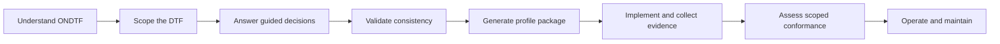

# Adoption

ONDTF adoption is a staged institutional and technical programme, not a single platform procurement. Begin with **[Adopt ONDTF](adopt-ondtf.md)** for one operational path from suitability and scoping through construction, implementation, evidence and conformance.

## Operational adoption path

1. [Adopt ONDTF](adopt-ondtf.md)
2. [Starter Package](starter-kit.md)
3. [Guided Framework Construction](guided-framework-construction.md)
4. [Construction stages](construction-stages.md)
5. [Decision states and review gates](decision-states-and-review-gates.md)
6. [Contradiction and completeness checks](contradiction-and-completeness.md)
7. [Generated artefacts](generated-artefacts.md)
8. [Workshop facilitation guide](workshop-guide.md)
9. [Model and implementation guide](guided-construction-model.md)
10. [Portability and external patterns](portability-and-external-patterns.md)
11. [Worked operational profile](../../examples/worked-profile/)

## Role-based adoption paths

- [Policy reader path](policy-reader-path.md)
- [Architect reader path](architect-reader-path.md)
- [Implementer reader path](implementer-reader-path.md)
- [Assurance reader path](assurance-reader-path.md)
